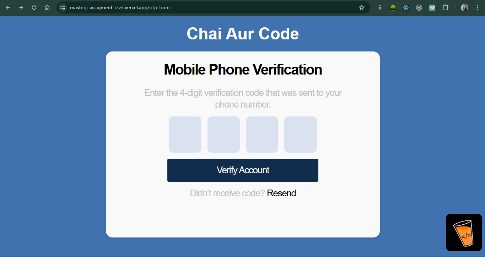
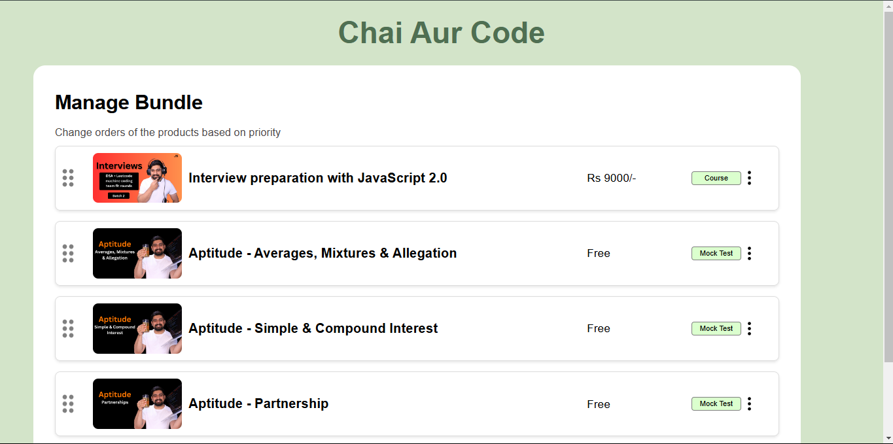
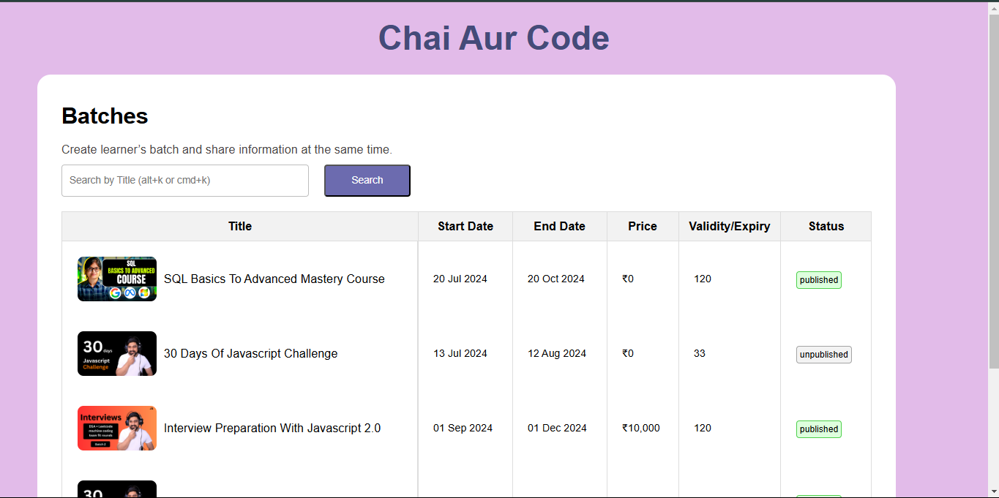

## Masterji.com Platform Machine Coding Assignment

This project is a submission for the machine coding assignment from the Masterji.com platform. The project consists of three main sections: OTP Form, Drag and Drop Course Cards, and a Data Table. Each section is implemented as a separate React component with its own URL route.

## Project Structure

```plaintext
public/
  └── images/
      └── (all images)
  └── index.html/
src/
  ├── components/
  │   ├── otp/
  │   │   ├── FormContainer.js
  │   │   ├── OtpForm.js
  │   │   └── OtpInput.js
  │   ├── DragDrop/
  │   │   ├── CourseCard.js
  │   │   └── CourseList.js
  │   ├── Batches/
  │   │   ├── BatchesList.js
  │   │   ├── Table.js
  │   │   └── Pagination.js
  └── utils/
      ├── coursedata.js
      └── batchesdata.js
```
## Live Link
[Live Project](https://masterji-assigment-rzv3.vercel.app/)

## Project Details

### OTP Form
A form to input a 4-digit OTP with the following states:
- **Empty Form State:** A form to input a 4-digit OTP
- **Filling State:** The state during the input of the OTP
- **Filled State (Success):** The state when the OTP is correctly filled
- **Filled State (Error):** The state when the OTP is incorrectly filled

### Drag and Drop Course Cards
A vertical list of course cards using a drag-and-drop library. Each card includes actions for:
- "Move to Top"
- "Move to Bottom"
- "Remove"

### Data Table
A paginated table listing batches of a course and their statuses. It includes a search option to filter the batches.

## Routes
The application has the following URL routes for each section:
- **/otp-form:** The OTP form
- **/course-list:** The Drag and Drop Course Cards
- **/batches:** The Data Table

The base URL (/) redirects to the /otp-form route.

## screenshots




## Getting Started

### Prerequisites
- Node.js
- npm

### Installation
1. Clone the repository:
    ```sh
    git clone https://github.com/Esha-Sharmaa/masterji-assigment.git
    ```
2. Navigate to the project directory:
    ```sh
    cd masterji-machine-coding-assignment
    ```
3. Install the dependencies:
    ```sh
    npm install
    ```

### Running the Application
To start the development server:
```sh
npm start
```
This will run the application on `http://localhost:3000`.

### Building for Production
To create a production build:
```sh
npm run build
```
This will create an optimized build in the `build` directory.

## Components

### OTP Form
- **FormContainer.js:** Wrapper component for the OTP form.
- **OtpForm.js:** Main component for the OTP form.
- **OtpInput.js:** Component for the OTP input field.

### Drag and Drop Course Cards
- **CourseCard.js:** Component for individual course cards.
- **CourseList.js:** Component for the list of course cards.

### Data Table
- **BatchesList.js:** Component for the list of batches.
- **Table.js:** Component for the paginated table.
- **Pagination.js:** Component for pagination controls.

## Utilities
- **coursedata.js:** Data for the course cards.
- **batchesdata.js:** Data for the batches table.

## Contributing
Contributions are welcome! Please open an issue or submit a pull request.